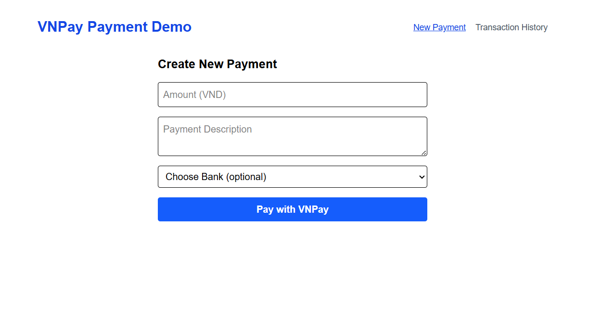
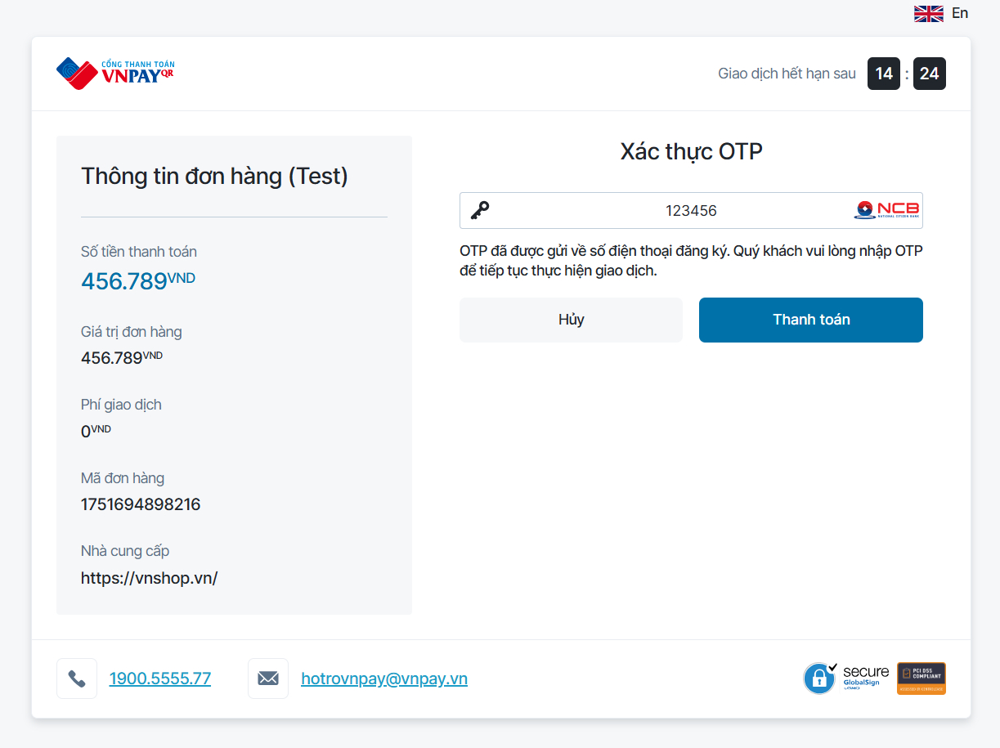
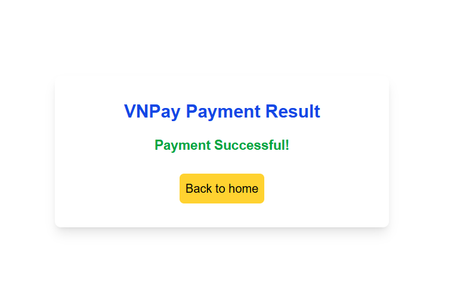
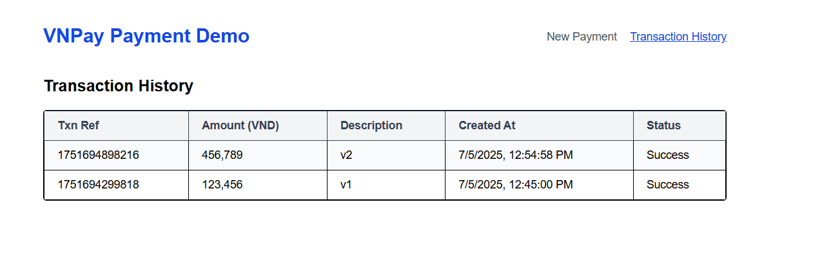

# VNPay Payment Integration

This project is built with **Next.js** to fulfill the Backend Developer take-home assignment for **Aiicul**.  
It demonstrates backend integration with the **VNPay** payment gateway, simulating a payment flow with sandbox credentials.

---

**Production URL:** [https://demo-vnpay-phi.vercel.app](https://demo-vnpay-phi.vercel.app)

---

## Tech Stack

- **Next.js** (App Router, TypeScript)
- **Tailwind CSS** (for UI styling)
- **VNPay Sandbox API**
- **LocalStorage** (to simulate transaction history)

---

## Features

- `/api/payment` POST API to generate VNPay payment links
- Support for optional bank code, language, and custom order info
- Dynamic return page showing payment result (success/fail)
- Transaction history saved locally (using `localStorage`)
- Configurable via environment variables

---

## API Specification

### `POST /api/payment`

#### Request Body

```json
{
  "amount": 100000,
  "orderInfo": "Test payment",
  "language": "vn",
  "bankCode": "NCB"
}
```

#### Response

```json
{
  "url": "https://sandbox.vnpayment.vn/paymentv2/vpcpay.html?...",
  "txnRef": "1751622521357"
}
```

---

## Local Setup

```bash
git clone https://github.com/nhungnguyen-9/vnpay-demo.git
cd vnpay-demo
npm install
cp .env.template .env.local
# → Fill in your VNPay credentials
npm run dev
```

Then open: [http://localhost:3000](http://localhost:3000)

---

## Environment Variables

Create a `.env.local` file like this:

```env
VNP_TMN_CODE=YOUR_VNP_TMNCODE
VNP_HASH_SECRET=YOUR_VNP_SECRET
VNP_RETURN_URL=http://localhost:3000/vnp/payment_return
```

In production (Vercel), update `VNP_RETURN_URL` like this:

```env
VNP_RETURN_URL=https://your-vercel-app.vercel.app/vnp/payment_return
```

---

## Design Notes

- VNPay sandbox only supports **VND** → currency selection removed.
- No database used → transactions stored in `localStorage`.
- `vnp_SecureHash` is generated using **HMAC SHA512**.
- Parameters are **sorted alphabetically** before signing, as required by VNPay.
- The return page reads payment status using `useSearchParams()`.

---

## Screenshots





